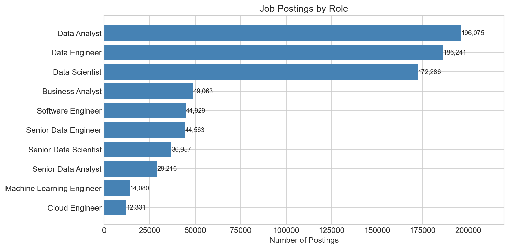
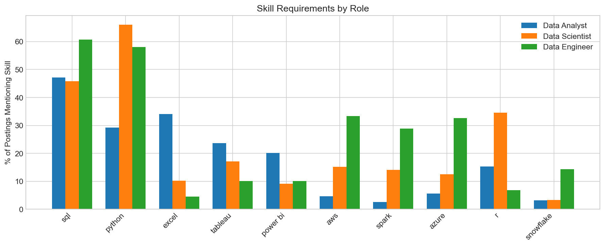
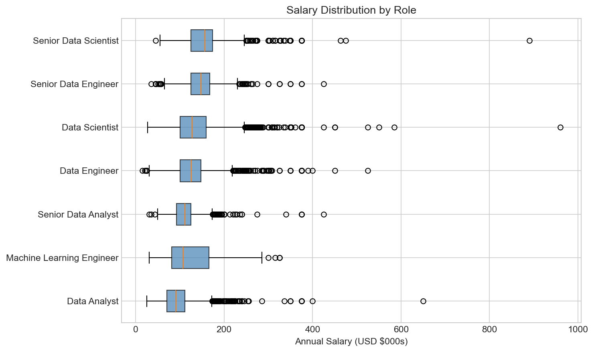

# Job Market Trends Analysis

A quantitative analysis of 785,000+ real-world job postings from 2023, examining global skill demand, salary anomalies, and hiring trends in the Data Jobs market

## Questions Explored

- Which data roles are employers hiring for most frequently?
- What skills differentiate Data Analysts, Data Scientists, and Data Engineers?
- How is job demand distributed globally?
- What salary ranges can candidates expect by role and seniority?
- How available is remote work across different roles?

## Dataset

**Source:** Jobs Data from [lukebarousse/data_jobs](https://huggingface.co/datasets/lukebarousse/data_jobs) on Hugging Face. Original data scraped from Google Jobs, LinkedIn, Indeed, and other platforms.

**Size:** 785,000+ job postings 

**Coverage:** Global, with US representing ~26% of postings. Primarily English-language sources.

**Time period:** 2023

## Key Insights

- **SQL and Python skills in demand.** They appear in the majority of all data role postings.

- **Role specialization is real.** Data Analysts need BI tools (Excel, Tableau, Power BI), Data Scientists need Python/R and ML skills, Data Engineers need cloud infrastructure (AWS, Spark, Snowflake).

- **Data Analyst is the most common role** and likely the most accessible entry point into data careers.

- **AWS dominates cloud platforms** in job requirements, appearing significantly more than Azure or GCP.

- **Senior roles command 30-50% salary premiums** over equivalent mid-level positions.

- **Salary transparency is very limited** - only ~5% of postings include compensation data.

- **Remote work varies by role** - 10-20% of postings offer remote options, with higher availability for senior and engineering positions.

## Sample Visualizations

### Job Role Distribution


### Skill Demand by Role


### Salary Distribution by Role



  

## How to Run

```bash
# Generate figures
python generate_figures.py

# Open the notebook
jupyter notebook job_market_analysis.ipynb
```

Requires: Python 3.8+, pandas, matplotlib, seaborn, numpy

## Limitations

- English-language and US-market bias in source data
- Only ~5% of postings include salary data (likely non-representative)
- Skill extraction via keyword matching has inherent limitations
- Some data quality issues (e.g., suspicious country classifications)

## Next Steps

- Analyze full dataset for more robust conclusions
- Break down trends by specific countries/regions
- Track changes over multiple years
- Cross-reference with actual hiring outcomes where available
